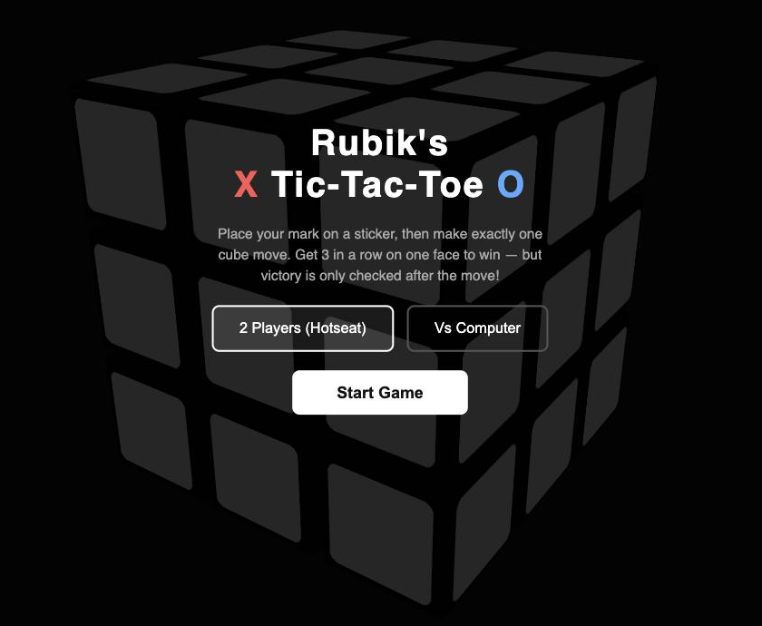

# 3D Tic-Tac-Toe Cube

Tic-tac-toe played on a Rubik's Cube. Place your mark, then twist the cube, and only then is the
board checked for a win. One twist can complete your line or break your opponent's.

**Play it:** https://3-d-tic-tac-toe-cube-game.vercel.app

## Rules

- Player 1 is X, player 2 is O.
- On your turn, place a mark on any empty sticker, then make exactly one cube move (U, D, R, L, F, B, or their inverses).
- Win with 3 in a row on any single face, checked after the twist.

## Features

- Drag to rotate the whole cube and inspect every side
- Twist with on-screen buttons or by dragging a layer, with a visual cue showing which way it will turn
- Two-player hotseat or play against the computer

## Run it

Open `3D-tic-tac-toe-cube-game.html` in a browser. No build step: it's one file using Three.js from a CDN.

## How it was made

Designed and built entirely by prompting an AI coding agent. The full prompt history is in
[`prompt.md`](prompt.md).
